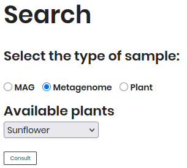
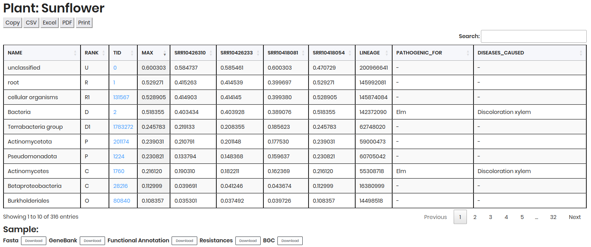
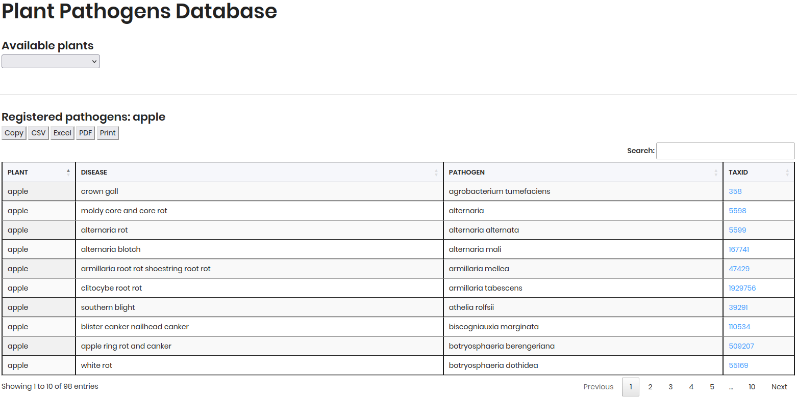

# Search Section

Filter your search using the following options:

**1. Sample Type**

- **MAG** (*Metagenome-Assembled Genomes*): Genomes reconstructed from metagenomic data.  
- **Metagenome**: Results of metagenomic samples.  
- **Plant Disease**: Data related to pathogenic plant-microbe interactions.  

**2. Available Plants**

Select a plant from the dropdown menu after choosing a sample type.

**3. Run Query**

Enter a **Run ID** directly to retrieve your results.

Click **Consult** to execute your search.

## Search Examples

### By MAG

Follow these steps to explore **Metagenome-Assembled Genomes (MAGs)**:

1. **Select "MAG"** as the sample type.  
2. **Choose a plant** (e.g., *Soya bean*) from the dropdown.  
3. Click **Consult** to view results.  

The results will display a table of MAGs, including details such as `BIN ID`, `HOST NAME`, `SAMPLE`, `PLANT PART`, `COMPLETENESS`, `CONTAMINATION`, etc.

### By Metagenome

Follow these steps to explore **Metagenome**:

1. **Select "Metagenome"** as the sample type.  
2. **Choose a plant** (e.g., *Sunflower*) from the dropdown.  
3. Click **Consult** to view results.  

The results will display two tables:

   - **Samples**: Contains sample metadata such as `SAMPLE`, `HOST NAME`, `PLANT PART`, `ASSAY_TYPE`, etc.

   - **Comparative table**: Contains detailed data on microbial presence and abundance, including `NAME`, `RANK`, `TID`, `MAX`, `RELATIVE ABUNDANCE` of each sample, etc.

### By Plant Disease

Follow these steps to explore **Plant Disease** data:

1. **Select "Plant Disease"** as the sample type.
2. **Choose a plant** (e.g., *Apple*) from the dropdown.
3. Click **Consult** to view results.

The results will display a table of plant disease data, including `PLANT`, `DISEASE`, `PATHOGEN` and `TAXID`. 

