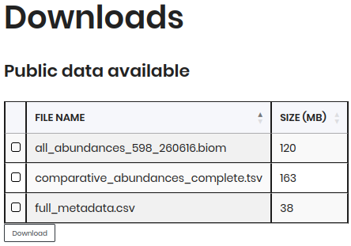

# Downloads

In this section, you can download the data used in MicroAgrobiome platform for the microbiome analysis. The data includes different types of files such as `biom`, `tsv`, and `csv` files, which contain information about abundances, comparative abundances, and metadata of the samples, respectively.

