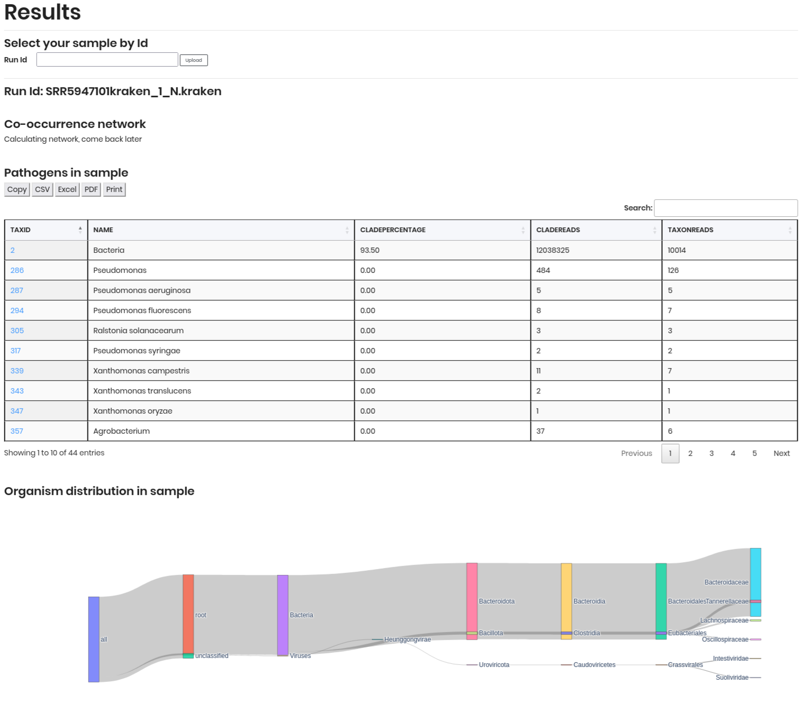

# Check resutls

In this section, you can check the results of your sample processing. After submitting your sample in the **Process Your Sample** section, you will be redirected to this page to view the status and results of your sample. Or you can access this page directly to check the results of your sample by entering the **Run ID**.

To check the results of your sample, follow these steps:

1. **Run ID**: Enter the unique identifier for your sample in the text field. This ID is generated when you submit your sample in the **Process Your Sample** section.
2. **Upload**: Click the **Upload** button to retrieve the results associated with the provided Run ID.
3. **Results**: The results will be displayed in a table format, showing the status of your sample processing. 

The resutls will be different depending on the sample type you submitted. For example: 
- If you submitted a **kraken.report** file, the results will include the table with the taxonomic classification of your sample, including columns such as `TAXID`, `NAME`, `CLADEPERCENTAGE`, `CLADEREADS`, and `TAXONREADS`. Moreover, it will also include a *Organism distribition in sample* section, which provides a visual representation in Sankey format of the taxonomic distribution of organisms in your sample.

- If you submitted a **biom** file, the results will include the table with abundance data of the organisms in your samples. Additionally, you can to dowload the *co-occurence network* in a `.csv` format, which can be used for further analysis or visualization in network analysis tools.

