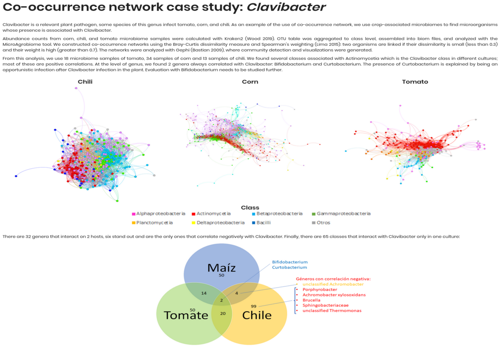

# Examples

## Co-ocurrence Network Case Study: *Clavibacter*

This section provides an example of how to analyze co-occurrence networks using the *Clavibacter* dataset. The dataset includes various *Clavibacter* species, and the analysis focuses on identifying microbial genera associated with Clavibacter across plant microbiomes (chili, corn, tomato).

**Input:**

- OTU tables from microbiome samples (Kraken2) aggregated at genus level.

**Analysis:**

- Bray-Curtis dissimilarity and Spearman correlation.
- Links defined by dissimilarity < 0.3 and weight > 0.7.
- Networks built and visualized in Gephi, colored by class.

**Samples:**

- Chili (n = 13)
- Corn (n = 34)
- Tomato (n = 18)

**Findings:**

- Bifidobacterium and Curtobacterium consistently correlated with Clavibacter.
- 6 genera negatively correlated across two hosts.
- 65 taxa showed host-specific associations.

Includes co-occurrence graphs and Venn diagram summarizing genus overlap across hosts.

