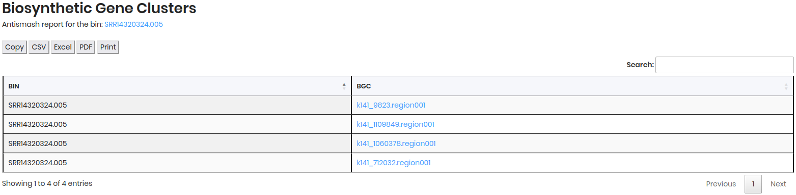
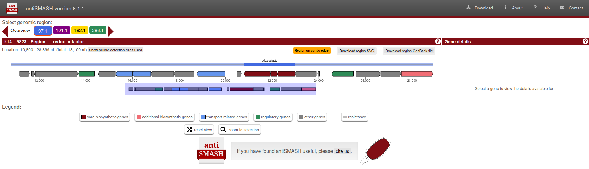

# Annotated Genome

After submitting your query for **Metagenome-Assembled Genomes (MAGs)** in the search section of the Agromicrobiome portal, you will be directed to the **Annotated Genomes** tab. This section provides detailed information about the MAGs associated with your selected plant and sample type.

- `BIN ID`: Unique genome identifier  
- `HOST NAME`: Source plant species  
- `SAMPLE`: Origin of the metagenomic data  
- `PLANT PART`: Specific tissue sampled  
- `COMPLETENESS`: Genome quality metric (%)  
- `CONTAMINATION`: Potential contamination level (%)

**Filters & Export Options**

Refine and download your results using the following tools:

- **Filters**
  - **Sample**: Filter by sample source.  
  - **Part**: Filter by plant part (e.g., root, leaf).  
- **Download Formats**
  - **Copy**: Copy table to clipboard.
  - **CSV**: Export as CSV file.
  - **Excel**: Download as Excel spreadsheet.
  - **PDF**: Generate a PDF report.
  - **Print**: Print the table directly. 

Use the **Search** bar to further narrow down results.

## BIN ID Details

Click on a `BIN` to access detailed information about the genome, including:

1. **General Information**:  
   - `BIN ID`: Unique identifier for the genome.  
   - `HOST NAME`: Plant species from which the sample was derived.  
   - `SAMPLE`: Specific sample name or identifier.  
   - `PLANT PART`: Part of the plant sampled (e.g., root, leaf).
   - `COMPLETENESS`: Percentage of the genome that is complete.
   - `CONTAMINATION`: Percentage of contamination in the genome.

2. **Biosynthetic Gene Clusters**:  
   - `BIN`: Unique identifier for the genome.
   - `BGC`: Biosynthetic gene cluster identifier.

In this section, click on the `BGC` to view detailed information about the biosynthetic gene clusters associated with the genome in Antismash portal.

3. **Functional Annotation**:
   
    This section, you can explore the functional annotations of the genome with Krona visualization, using EZ numbers to identify specific functions or pathways associated with the genes in the genome.

4. **Antibiotic resistances**:

    This section provides a heatmap visualization of the antibiotic resistance genes identified in the genome  by RGI. The heatmap displays the number of antibiotic resistance genes (ARGs) detected, categorized by antibiotic class and resistance mechanism.

## SAMPLE ID Details

Click on a `SAMPLE` to access detailed information about the sample in **Sequence Read Archive (SRA)**.

