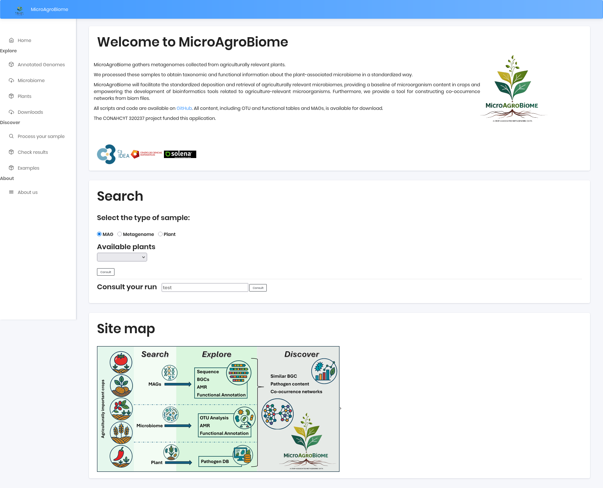

# Home Page

Welcome to the **Agromicrobiome Project** portal. This page provides an overview of the project and access to its key features.

1. **Welcome to Agromicrobiome**
   
    A brief introduction to the project’s goals and scope.

1. **Search**

    Use the search field to explore data by:  
    - **Sample type**  
    - **Available plants**  
    - **Consult your run**

3. **Site Map**

    A visual guide to the available data, organized by:
    - **Search and exploration** (for sample types and data)  
    - **Discover** (additional resources)  

