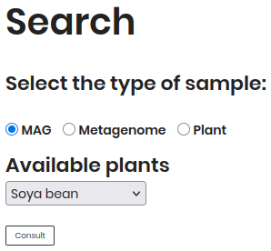
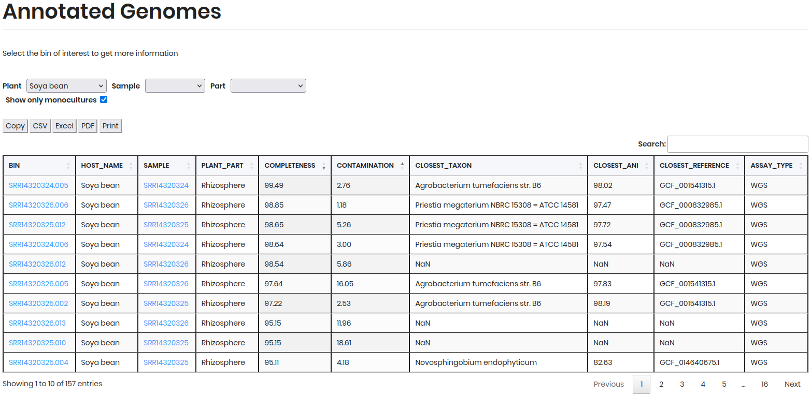

# Home Page

Welcome to the **Agromicrobiome Project** portal. This page provides an overview of the project and access to its key features.

### 1. **Welcome to Agromicrobiome**

A brief introduction to the project’s goals and scope.

### 2. **Search**

Use the search field to explore data by:  
- **Sample type**  
- **Available plants**  
- **Consult your run**

### 3. **Site Map**

A visual guide to the available data, organized by:
- **Search and exploration** (for sample types and data)  
- **Discover** (additional resources)  

---

## Search Section

Filter your search using the following options:

### **1. Sample Type**

- **MAG** (*Metagenome-Assembled Genomes*): Genomes reconstructed from metagenomic data.  
- **Metagenome**: Results of metagenomic samples.  
- **Plant Disease**: Data related to pathogenic plant-microbe interactions.  

### **2. Available Plants**

Select a plant from the dropdown menu after choosing a sample type.

### **3. Run Query**

Enter a **Run ID** directly to retrieve your results.

Click **Consult** to execute your search.

---

## Example: Search by MAG

Follow these steps to explore **Metagenome-Assembled Genomes (MAGs)**:

1. **Select "MAG"** as the sample type.  
2. **Choose a plant** (e.g., *Sunflower*) from the dropdown.  
3. Click **Consult** to view results.  

## Annotated Genome Tab (Results MAG Search)

After submitting your query, you'll be redirected to the **Annotated Genomes** tab, where the results are displayed. The table includes the following details for each MAG:

- `BIN ID`: Unique genome identifier  
- `HOST NAME`: Source plant species  
- `SAMPLE`: Origin of the metagenomic data  
- `PLANT PART`: Specific tissue sampled  
- `COMPLETENESS`: Genome quality metric (%)  
- `CONTAMINATION`: Potential contamination level (%)  

**Filters & Export Options**

Refine and download your results using the following tools:

### **Filters**

- **Sample**: Filter by sample source.  
- **Part**: Filter by plant part (e.g., root, leaf).  

### **Download Formats**
| Option   | Action                          |
|----------|---------------------------------|
| Copy     | Copy table to clipboard.        |
| CSV      | Export as CSV file.             |
| Excel    | Download as Excel spreadsheet.  |
| PDF      | Generate a PDF report.          |
| Print    | Print the table directly.       |

Use the **Search** bar to further narrow down results.

---
