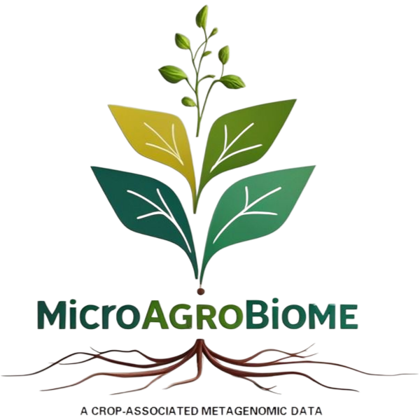

.. Agromicrobiome Manual documentation master file, created by
   sphinx-quickstart on Sat Jun 21 11:07:37 2025.
   You can adapt this file completely to your liking, but it should at least
   contain the root `toctree` directive.

Welcome to Agromicrobiome's documentation!
=================================================

MicroAgrobiome gathers metagenomes collected from agriculturally relevant plants.

We processed these samples to obtain taxonomic and functional information about the plant-associated microbiome in a standardized way.

MicroAgrobiome will facilitate the standardized deposition and retrieval of agriculturally relevant microbiomes, providing a baseline of microorganism content in crops and empowering the development of bioinformatics tools related to agriculture-relevant microorganisms. Furthermore, we provide a tool for constructing co-occurrence networks from biom files.

All scripts and code are available on `Github <https://github.com/nselem/microagrobioma>`_. All content, including OTU and functional tables and MAGs, is available for download.

The CONAHCYT 320237 project funded this application. 

.. rst-class:: centered-table

.. list-table::
   :widths: 30 30 30
   :align: center
   :class: borderless

   * - .. image:: _static/C3idea.png
          :width: 100px
          :align: center
     - .. image:: _static/ccm.png
          :width: 150px
          :align: center
     - .. image:: _static/solena.png
          :class: logo-darkbg
          :width: 150px
          :align: center

.. toctree::
   :maxdepth: 2
   :caption: Contents:

   home.md
   home_search.md
   anotated_genomes.md
   microbiome.md
   plant_pathogens.md
   process_your_sample.md
   check_results.md
