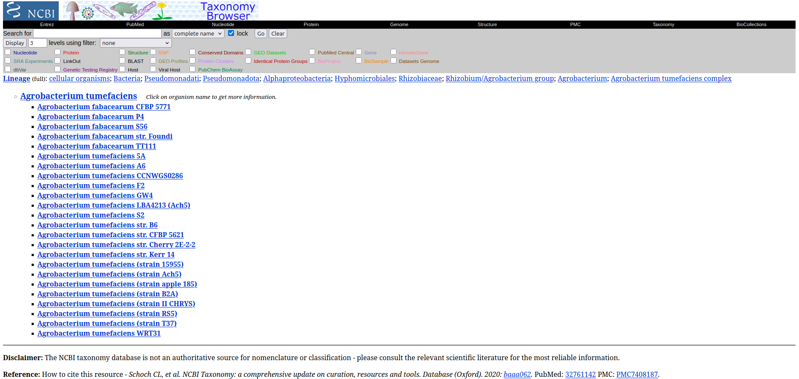

# Microbiome

After submitting your query for **Metagenome** in the search section of the Agromicrobiome portal, you will be directed to the **Microbiome** tab. This section provides detailed information about the microbiome data associated with your selected plant and sample type.

The results will display two tables:

## Samples

Contains sample metadata such as `SAMPLE`, `HOST NAME`, `PLANT PART`, `ASSAY_TYPE`, etc.

Click on a `NCBI` to access detailed information about the sample in **Sequence Read Archive (SRA)**.

Click on a `SAMPLE` to access detailed information about the sample. This information is a Krona visualization of the microbial community composition, showing the relative abundance of different taxa in the sample.

Additionally, you can dowload the different files associated with the sample, such as `FASTA`, `GeneBank`, `Functional Annotation`, `Resistances`, and `BGC` files, which are essential for further analysis.

## PAVIAN-like

Contains detailed data on microbial presence and abundance, including `NAME`, `RANK`, `TID`, `MAX`, `RELATIVE ABUNDANCE` of each sample, etc.

Click in a `TID` to access detailed information about the taxon in **NCBI Taxonomy**.

