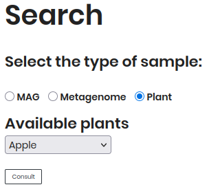

# Plants

After submitting your query for **Plant Disease** in the search section of the Agromicrobiome portal, you will be directed to the **Plants** tab. This section provides detailed information about the plant disease data. The results will display a table of plant disease data, including `PLANT`, `DISEASE`, `PATHOGEN` and `TAXID`.

Click on a `TAXID` to access detailed information about the pathogen in **NCBI Taxonomy**.

