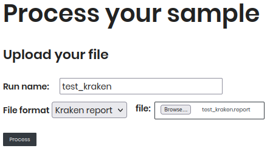

# Process your sample

This section you can submit your sample to the Agromicrobiome Project. You can use different input formats, such as **kraken.report**, **braken.report** or **biom** files. 

**How to submit your sample:**

1. **Run name**: Enter a unique name for your sample in the text field. This name will be used to identify your sample in the database.
2. **Select Sample Type**: Choose the type of sample you are submitting from the dropdown menu. Options include:
   - **kraken.report** (*Kraken report file*): A file generated by the Kraken tool, which provides taxonomic classification of metagenomic sequences. 
   -  **braken.report** (*Bracken report file*): A file generated by the Bracken tool, which estimates species abundance from metagenomic data.
   -  **biom** (*BIOM file*): A file format used for representing biological sample data, commonly used in microbiome studies.
3. **Upload Your File**: Click the **Browse** button to select your file from your local system.
4. **Process**: After selecting your file, click the **process** button to process your sample.

After processing, you will be redirected to the **Check Results** page, where you can view the status of your sample processing and access the results.